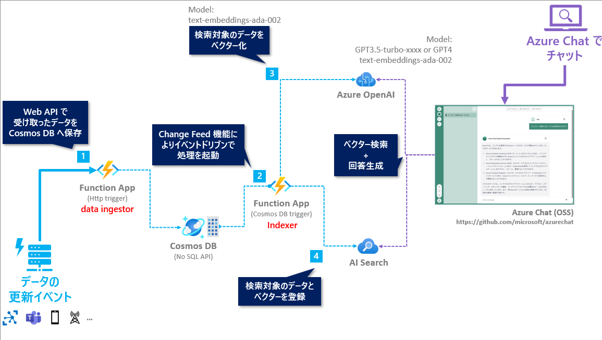

# Azure OpenAI Service x RAG パターン実践ハンズオン: Python + Azure Chat 編

## 💫 概要とゴール

このハンズオンでは、Cosmos DB と AI Search をデータストアとした Retrieval Augmented Generation (RAG) パターンの実践の基礎として、**独自データを含めた回答を生成するために必要な検索インデックスを、元のデータの更新に応じてリアルタイムに生成するデータパイプラインを構築する** ことがゴールです。

以下の要素が含まれます。

- 独自のデータを検索対象としたベクター検索が可能な検索インデックスの作成
  - このハンズオンでは、このリポジトリの[data/sample-data.json](./data/sample-data.json)にある Azure のサービスの一覧の情報を独自データとして利用し、検索インデックスを作成します。
- イベントドリブンによるリアルタイムで継続的な検索インデックスの更新

開発言語は、Python を利用します。

 

## 🗺️ アーキテクチャ構成

ハンズオンで実現するアーキテクチャ構成は以下となります。

Azure OpenAI と AI Search を活用し以下のプログラムを実装してゴールを目指します。

- **data ingestor** (図:左側): REST API を構成し、独自のデータを受け取り Cosmos DB へデータを保存を実現
- **Indexer** (図:中央): Cosmos DB へのデータの登録・更新のイベントをトリガーにして、ほぼリアルタイムに AI Search のインデックス更新を実現
- **Azre Chat** (図:右側): Microsoft が OSS で公開しているチャットのプログラム "Azure Chat" をローカルデバッグして独自データを使ったチャットを体験します。
  - 時間の都合上、このプログラムの詳細の説明はしませんが、[こちらのリポジトリ](https://github.com/microsoft/azurechat) で公開されていますのでご興味がありましたらご参照ください。
  - 今回利用する Azure Chat は、ハンズオン用に ZEN Architects でカスタマイズしたものです。

 

## 🚧 Azure のリソース作成時の注意

**※ 今回のハンズオンでは、Auzre のリソースを作成することで料金が発生するリソースもあります。ご自身の状況に応じて、今回のハンズオンの最後にリソースグループごとすべて消すなどは自己責任で行なってください。**

 

## 🔖 ハンズオンの構成

0～3のチャプターで今回利用する Azure のリソースをセットアップし実装を進めていきます。

タイトル | 概要
--- | ---
[🧪 Azure OpenAI Service のセットアップ](./docs/setup-azure-openai.md) | 今回のハンズオンで利用する Azure OpenAI Service のセットアップをします。
[🧪 Azure のリソースをセットアップ](./docs/setup-azure-resources.md) | 今回のハンズオンで利用する Azure のリソースをセットアップします。
[🧪 テンプレートのコードをセットアップ](./docs/setup-function-app-code.md) | 今回利用する Function App のコードのテンプレートをセットアップします。
[🧪 indexer.py の実装](./docs/implement-indexer.md) | Function App で Change Feed 機能を活用して AI Search のインデックスのデータを更新する処理を実装します。
[🧪 data_ingestor.py の実装](./docs/implement-data-ingestor.md) | Function App で、Cosmos DB のデータを更新する処理を実装します。
[🧪 Azure Chat でチャットの動作を試す](./docs/setup-azurechat.md) | Azure Chat をローカルデバッグして、独自データを使ったチャットを体験します。
[🚮 Azure のリソース削除](./docs/remove-azure-resources.md) | Azure のリソースを削除する方法を説明します。

 

## 🛠️ 事前準備

- Azure サブスクリプション
  - Azure OpenAI やリソースグループなど各種リソースを作成するため、作成できる権限が必要になります。
  - Azure OpenAI は、サブスクリプションによっては事前にマイクロソフトへの申請が必要な場合もあります。申請に関しては[こちら](https://learn.microsoft.com/ja-jp/azure/ai-services/openai/overview#how-do-i-get-access-to-azure-openai)をご確認ください。
- GitHub アカウント
  - 開発環境の構築の手間を省くため、開発環境として GitHub Codespaces を利用します。GitHub の Free プランであれば無料枠があるため利用可能です。

## 🧑‍💻 Let's Get Started

以下のリンクからハンズオンの旅に出発しょう🚀

- [🧪 Azure OpenAI Service のセットアップ](./docs/setup-azure-openai.md)
