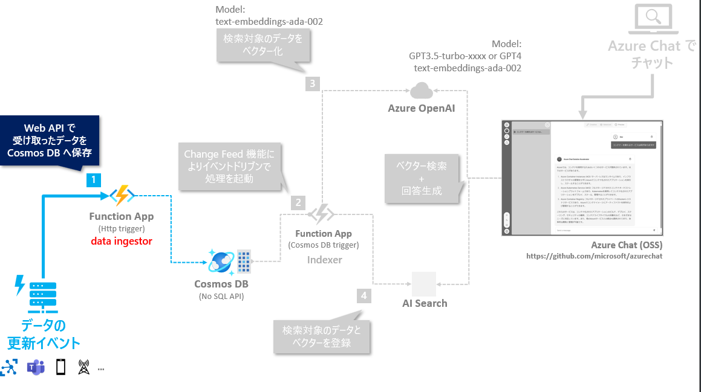
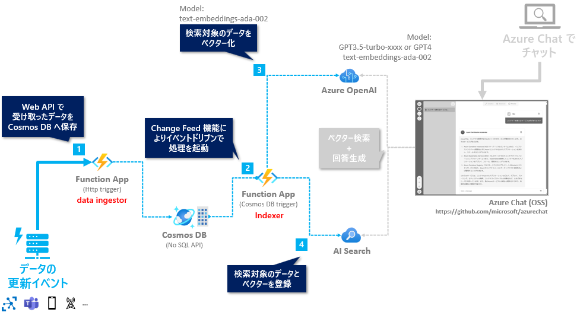

# 🧪 D4. data_ingestor.py の実装

ここでは data_ingestor.py に、Cosmos DB へデータを upsert する API を実装します。



## 🔖 Cosmos DB へデータを Upsert する処理を実装

### Cosmos DB のデータ追加・更新の実装

data_ingestor.py を開きます。

Cosmos DB のデータ操作は、Azure Cosmos DB Python SDK を利用することで容易に実現できます。今回は upsert でデータを更新します。実装するコードは以下です。

> 📝 具体的な操作やポイントはトレーナーが説明します。

```python
import azure.functions as func
from azure.cosmos import CosmosClient
import os

data_ingestor_bp = func.Blueprint()

COSMOS_DATABASE_NAME = "chat"
COSMOS_CONTAINER_NAME = "azure"

cosmos_client = CosmosClient.from_connection_string(os.getenv("COSMOS_CONNECTION"))


@data_ingestor_bp.function_name(name="data-upload")
@data_ingestor_bp.route(route="data/upload_json", methods=["POST"], auth_level=func.AuthLevel.FUNCTION)
def upload_json(req: func.HttpRequest) -> func.HttpResponse:
    container = cosmos_client.get_database_client(COSMOS_DATABASE_NAME).get_container_client(COSMOS_CONTAINER_NAME)

    items = req.get_json()
    for item in items:
        container.upsert_item(item)

    return func.HttpResponse(f"{len(items)} data uploaded.", status_code=200)

```

### デバッグ実行: Cosmos DB のデータ追加・更新

デバッグ実行を行い、以下のポイントを参考に `handson-app` が正常に動作することを確認します。

> 📝 具体的な操作とポイントはトレーナーが説明します。

- ✅ Function App をデバッグ実行して正常に起動することを確認
- ✅ REST.http を使って API をコールし、想定されたレスポンスが返ってくることを確認
  - データは、[サンプルデータ](../data/sample-data.json) を利用します。
  - REST.http での送信例は以下です。

  ```http
  ### data ingenstor: Upload array of json
  
  POST http://localhost:7071/api/data/upload_json
  Content-Type: application/json

  [
      {
          "id": "3",
          "title": "Azure Cognitive Services",
          "content": "Azure Cognitive Services are a set of AI services that enable you to build intelligent applications with powerful algorithms using just a few lines of code. These services cover a wide range of capabilities, including vision, speech, language, knowledge, and search. They are designed to be easy to use and integrate into your applications. Cognitive Services are fully managed, scalable, and continuously improved by Microsoft. It allows developers to create AI-powered solutions without deep expertise in machine learning.",
          "category": "AI + Machine Learning"
      },
      {
          "id": "4",
          "title": "Azure Storage",
          "content": "Azure Storage is a scalable, durable, and highly available cloud storage service that supports a variety of data types, including blobs, files, queues, and tables. It provides a massively scalable object store for unstructured data. Storage supports data redundancy and geo-replication, ensuring high durability and availability. It offers a variety of data access and management options, including REST APIs, SDKs, and Azure Portal. You can secure your data using encryption at rest and in transit.",
          "category": "Storage"
      }
  ]
  ```

  - indexer の Function app AI Search のインデックスが更新されることを確認


正常に動作が確認できたら、サンプルデータにある108件のデータを一括で登録してみます。REST.http で以下のように書くと、指定してファイルの内容をそのまま送信できます。  

※ 参加者全員で一斉に実行すると、モデルのクォータ制限によってエラーになる場合がありますのでご注意ください。

```http
### data ingenstor: Upload all data
POST http://localhost:7071/api/data/upload_json
Content-Type: application/json

< ../data/sample-data.json
```

<br>

## ⏭️ NEXT STEP ✨

おめでとうございます🎉  
ここまでで、Cosmos DB のデータの更新のイベントをトリガーとして Change Feed で AI Search のインデックスが更新されるまでのフローのローカルデバッグでの動作確認が完了しました。



今回のハンズオンでは、時間の都合上このプログラムを Function App へのデプロイする内容は含んでいませんが、興味がありましたら、以下を参考にお試しください。

- [Function App のセットアップ](./setup-function-app.md)
- [Azure へのデプロイ: Function App](./deploy-to-azure.md)

次は、チャットのプログラムである Azure Chat のコードをローカルで実行して、チャットボットが AI Search のインデックスを元に回答することを確認します。

---

[⏮️ 前へ](./implement-indexer.md) | [📋 目次](../README.md) | [⏭️ 次へ](./setup-azurechat.md)
