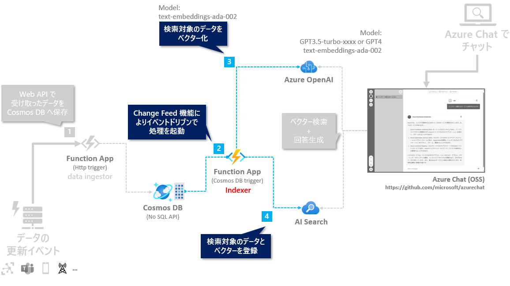

# 🧪 D2. indexer.py の実装

ここでは indexer.py に、Cosmos DB にデータが更新されたことをトリガーに、イベントドリブンでほぼリアルタイムにベクター検索するためインデックスの更新する処理を実装します。

> 📝 Cosmos DB の Change Feed の概要、ハンズオンで進める具体的な操作や重要なポイントはトレーナーが解説しながら進めます。



<br>

## 🔖 環境変数のセットアップ

Indexer の処理は、Azure OpenAI Service と Azure AI Search にアクセスするため、必要な情報を local.settings.json に追加します。

> 📝 具体的な操作やポイントはトレーナーが説明します。

<br>

## 🔖 Cosmos DB の Change Feed からデータを取得

indexer.py を開き、は以下のステップで実装を進めます。

- Azure OpenAI Service へ接続し、ベクター化する処理を実装
- AI Search のインデックス更新処理を実装

### ベクター化の処理を実装

ここでは、Azure OpenAI Service へ接続し、ベクター化する処理を実装します。  
コードは以下を参考に実装します。

> 📝 具体的な操作やポイントはトレーナーが説明します。

```python
import azure.functions as func
import logging
import os
from azure.core.credentials import AzureKeyCredential
from azure.search.documents import SearchClient
from openai import AzureOpenAI
from typing import List

indexer_bp = func.Blueprint()

ADA_DEPLOYMENT_NAME = "text-embedding-ada-002"
COSMOS_DATABASE_NAME = "chat"
COSMOS_CONTAINER_NAME = "azure"

aoai_client = AzureOpenAI(azure_endpoint=os.getenv("AZURE_OPENAI_ENDPOINT"),
                          api_key=os.getenv("AZURE_OPENAI_API_KEY"),
                          api_version="2023-05-15")


@indexer_bp.cosmos_db_trigger(arg_name="items",
                              connection="COSMOS_CONNECTION",
                              database_name=COSMOS_DATABASE_NAME,
                              container_name=COSMOS_CONTAINER_NAME,
                              create_lease_container_if_not_exists=False,
                              feed_poll_delay=5000,
                              lease_container_name="leases")
def indexer(items: func.DocumentList):

    # Change Feed で取得したデータを1件ずつ取得
    for item in items:
        # content の内容を Azure OpenAI Service にアクセスしてベクター化
        vector_content = get_vector(item["content"]);
        logging.info(f"{vector_content=}")

    # AI Search のインデックスのスキーマへ変更
    # TODO: 実装

    # AI Search のインデックスを upsert で更新
    # TODO: 実装

def get_vector(text: str) -> List[float]:
    return aoai_client.embeddings.create(input=text, model=ADA_DEPLOYMENT_NAME).data[0].embedding

```

### デバッグ実行: ベクター化の処理

デバッグ実行して、以下のポイントを確認します。

> 📝 具体的な操作はトレーナーが説明します。

- ✅ Function App をデバッグ実行して正常に起動することを確認
- ✅ Azure portal で Cosmos DB へサンプルデータを追加・変更
  - サンプルデータは[こちら](../data/sample-data.json)の中の任意の1レコードを追加・変更
- ✅ Function App が正しく動作して、ベクターの値がログに表示されることを確認


### AI Search のインデックス更新を実装

ここでは、先ほどの実装の続きとして、以下を実装します。

- Change Feed で取得したデータを AI Search のインデックスのスキーマへ変更
- 複数のデータを一括で、AI Search のインデックスへ upsert で更新

実装する index.py のコード全体は、以下になります。

> 📝 具体的な操作やポイントはトレーナーが説明します。

```python
import azure.functions as func
import logging
import os
from azure.core.credentials import AzureKeyCredential
from azure.search.documents import SearchClient
from openai import AzureOpenAI
from typing import List

indexer_bp = func.Blueprint()

ADA_DEPLOYMENT_NAME = "text-embedding-ada-002"
COSMOS_DATABASE_NAME = "chat"
COSMOS_CONTAINER_NAME = "azure"
AI_SEARCH_INDEX_NAME = "azure"

aoai_client = AzureOpenAI(azure_endpoint=os.getenv("AZURE_OPENAI_ENDPOINT"),
                          api_key=os.getenv("AZURE_OPENAI_API_KEY"),
                          api_version="2023-05-15")

search_client = SearchClient(os.getenv("AI_SEARCH_ENDPOINT"),
                             AI_SEARCH_INDEX_NAME,
                             AzureKeyCredential(os.getenv("AI_SEARCH_ADMIN_KEY")))


@indexer_bp.cosmos_db_trigger(arg_name="items",
                              connection="COSMOS_CONNECTION",
                              database_name=COSMOS_DATABASE_NAME,
                              container_name=COSMOS_CONTAINER_NAME,
                              create_lease_container_if_not_exists=False,
                              feed_poll_delay=5000,
                              lease_container_name="leases")
def indexer(items: func.DocumentList):

    documents_to_upsert = []
    # Change Feed で取得したデータを1件ずつ取得
    for item in items:
        # content の内容を Azure OpenAI Service にアクセスしてベクター化
        vector_content = get_vector(item["content"])

        # AI Search のインデックスのスキーマへ変更
        documents_to_upsert.append({
            "id": item["id"],
            "title": item["title"],
            "category": item["category"],
            "content": item["content"],
            "contentVector": vector_content})

    # 複数のデータを一括で、AI Search のインデックスへ upsert で更新
    search_client.merge_or_upload_documents(documents_to_upsert)
    logging.info(f"{len(documents_to_upsert)} document(s) uploaded")


def get_vector(text: str) -> List[float]:
    return aoai_client.embeddings.create(input=text, model=ADA_DEPLOYMENT_NAME).data[0].embedding

```

<br>

### デバッグ実行: AI Search のインデックスを更新

デバッグ実行して、以下のポイントを確認します。

> 📝 具体的な操作はトレーナーが説明します。

- ✅ Function App をデバッグ実行して正常に起動することを確認
- ✅ Azure portal で Cosmos DB へサンプルデータを追加・変更
  - サンプルデータは[こちら](../data/sample-data.json)の中の任意の1レコードを追加・変更
- ✅ Function App がエラーなく処理が完了することを確認
- ✅ Azure portal: AI Search のインデックスが更新されていることを確認

<br>


## 📚 参考情報

補足として、参考情報としてドキュメントの一部を紹介します。

- [Azure Cosmos DB によってトリガーされる関数を作成する | Microsoft Learn](https://learn.microsoft.com/ja-jp/azure/azure-functions/functions-create-cosmos-db-triggered-function)
- [Azure Cosmos DB 用 Azure Functions トリガーによるログと接続を構成する方法](https://learn.microsoft.com/ja-jp/azure/cosmos-db/nosql/how-to-configure-cosmos-db-trigger)
- [Functions 2.x 以降での Azure Cosmos DB のトリガー | Microsoft Learn](https://learn.microsoft.com/ja-jp/azure/azure-functions/functions-bindings-cosmosdb-v2-trigger?tabs=python-v2%2Cisolated-process%2Cextensionv4%2Cnodejs-v4&pivots=programming-language-python)

<br>

## ⏭️ NEXT STEP

これで Indexer の実装は完了です。Cosmos DB にデータが更新されたことをトリガーに、イベントドリブンでほぼリアルタイムにベクター検索するためインデックスの更新が実現できました。

次は、data_ingestor.py で、データを Cosmos DB に追加する API の実装に進みます。

---

[⏮️ 前へ](./setup-function-app-code.md) | [📋 目次](../README.md) | [⏭️ 次へ](./implement-data-ingestor.md)
