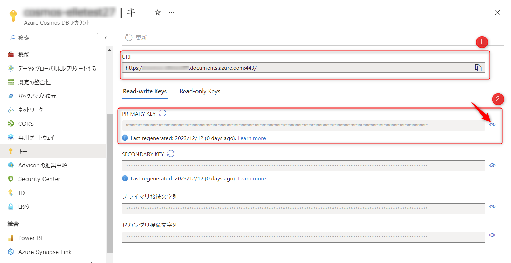
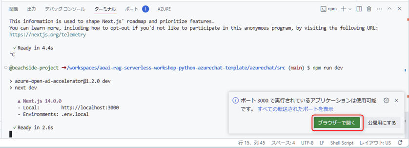
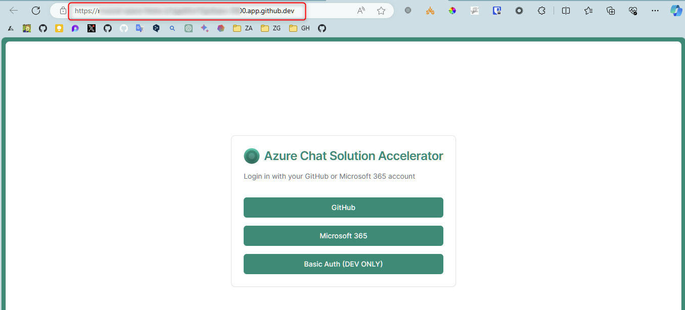
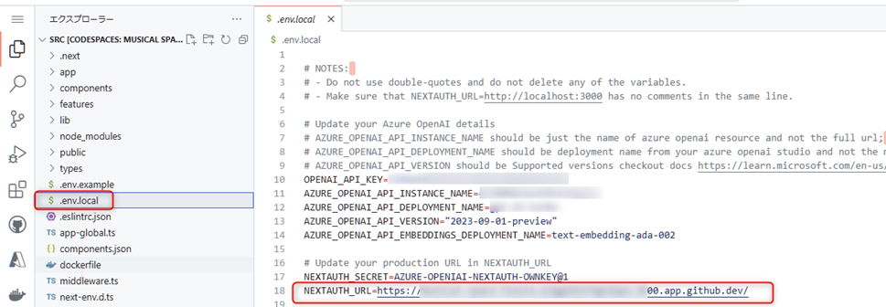
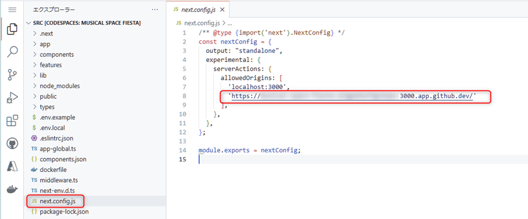
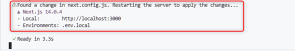
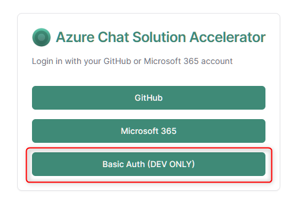
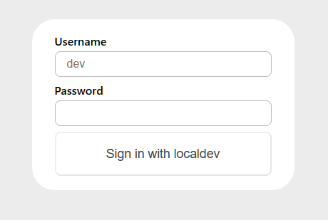
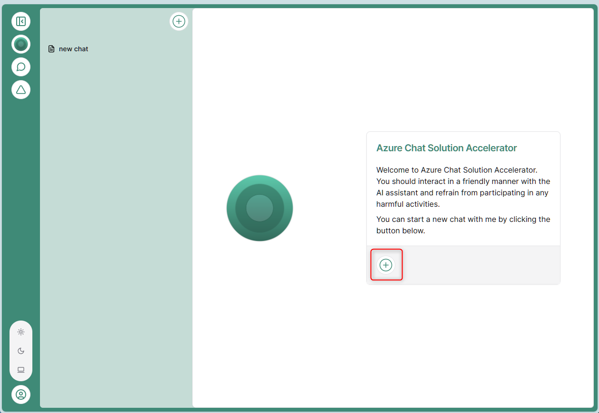
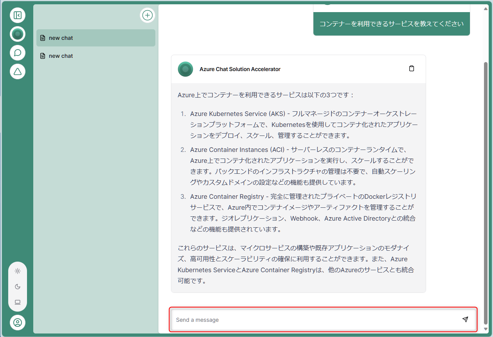

# 🧪 Azure Chat でチャットの動作を試す

ここでは、Azure Chat 用の Codespaces を起動し、ローカルで Azure Chat をデバッグしてチャットの動作を試します。

ここで実行する Azure Chat は、マイクロソフトが GitHub で OSS として公開しているチャットボットのプログラムを、このハンズオン用にカスタマイズしたプログラムです。  
Azure Chat に関する説明は時間の都合上割愛しますが、以下のリンクを参照してください。

- [azurechat - GitHub](https://github.com/microsoft/azurechat)

## 🔖 Azure Chat 専用の Codespaces を起動

ここからは、Azure Chat 専用の GitHub Codespaces を利用してハンズオンを進めます。  
先ほど起動した Function App の Codespace とは別に Codespace を起動します。

今回ハンズオンを行う repo で、"Code" ボタンをクリック (①) → "Codespaces" をクリック (②) → "..." をクリック (③) → "New with options" をクリック (④) します。


Cteate for Codespace の画面が表示されます。"Dev container configuration" で **Azure Chat** を選択し "Create codespace" をクリックすると、Codespaces が起動します。


起動まで数分かかります。起動すると、ブラウザ上で VS Code が起動します。

## 🔖 環境変数のセットアップ

Codespace を起動するとこの repo の src フォルダーが VS Code のルートとして開かれます。

最初に、`.env.example` をリネームして `.env.local` に変更します。  
リネームした `.env.local` を開き、以下を参考に値が空の環境変数を埋めていきます。

<br>

### Azure OpenAI の情報をセットアップ: env.local (9-13行目)

主に先ほどまで操作していた Function App の Codespace 内のファイル `local.settings.json` にセットされている値を参考にセットアップします。

env.local の行 | キー | 値
--: | --- | ---
9 | OPENAI_API_KEY | local.settings.json の AZURE_OPENAI_API_KEY の値を入力します。
10 | AZURE_OPENAI_API_INSTANCE_NAME | local.settings.json の AZURE_OPENAI_ENDPOINT が `"https://xxxxxx.openai.azure.com"` の場合、`xxxxxx` の値を入力します。
11 | AZURE_OPENAI_API_DEPLOYMENT_NAME | デプロイした GPT モデルの Deployment Name を入力します。
12 | AZURE_OPENAI_API_VERSION | "2023-09-01-preview" のままで OK です。
13 | AZURE_OPENAI_API_EMBEDDINGS_DEPLOYMENT_NAME | text-embedding-ada-002 の Deployment Name を入力します。

<br>

### Cosmos DB の情報をセットアップ: env.local (20-21行目)

まず Azure Portal で Cosmos DB のリソースを開き、左側のメニューから "キー" を開きます。



env.local (20-21行目) で以下を参考にセットアップします。

env.local の行 | キー | 値
--: | --- | ---
20 | AZURE_COSMOSDB_URI | 上図の URI の値 (①) を入力します。
21 | AZURE_COSMOSDB_KEY | 上図の PRIMARY KEY の値 (②) を入力します。目のアイコンをクリックするとコピーが可能になります。

※ local.settings.json を参考に入力も可能ですが、慣れていないとわかりにくいため Azure portal からの入力方法を説明しています。

<br>

### AI Search の情報をセットアップ: env.local (28-31行目)

主に先ほどまで操作していた Function App の Codespace 内のファイル `local.settings.json` にセットされている値を参考にセットアップします。

env.local の行 | キー | 値
--: | --- | ---
28 | AZURE_SEARCH_API_KEY | local.settings.json の AI_SEARCH_QUERY_KEY の値
29 | AZURE_SEARCH_NAME | local.settings.json の AI_SEARCH_ENDPOINT が `"https://zzzzzz.search.windows.net"` の場合、`zzzzzz` の値を入力します。
30 | AZURE_SEARCH_INDEX_NAME | `azure` のままで OK です。
31 | AZURE_SEARCH_API_VERSION | `"2023-07-01-Preview"` のままで OK です。


<br>

最後にすべての値が入力できていることを確認たら完了です。


## 🔖 Azure Chat をデバッグ実行

ターミナルを起動して以下のコマンドを実行します。

```cmd
npm install
```

次に以下のコマンドを実行して、ローカルで Azure Chat を起動します。

```cmd
npm run dev
```

正常に起動すると、以下のように表示されます。`ブラウザ―で開く` をクリックして、ブラウザで Azure Chat を開きます。



<br>

ここからローカルデバッグを正常に実行するための設定を行います。

ローカル起動だとややもっさりしていますが、以下の画面が表示されるまでお待ちください。表示されたら、URL の値をコピーします。



<br>

コピーした URL の値を2つの場所に貼り付けます。

1つ目です。Codespace で **env.local** を開き、`NEXTAUTH_URL` の値をコピーした URL に変更します。



<br>

2つ目です。Codespace で **next.config.js** を開き、8行目に URL の値をペーストします。値は、シングルクォートで囲みます。




<br>

ターミナルで更新されたことを確認します。



<br>

これで Azure Chat を動作させる設定が完了しました。Azure Chat を表示しているタブに戻り、"Basic Auth (DEV ONLY) をクリックします。



<br>

ログイン画面が表示されます。パスワードに適当な文字を入力してログインします (何を入力してもログインできるようになっています)。



<br>

以下の画面が表示されますので "+" をクリックします。初回起動時はもっさりしていますが数秒待つと、チャットの画面が表示されます。



<br>

下部の "Send a message" に Azure に関する質問をしてみましょう。Azure Chat は、ハンズオンで更新した AI Search のインデックスを元に回答を返します。  
参考までに質問の例は以下の通りです。

- 「セキュリティ関連のサービスは何がありますか」
- 「コンテナーを利用できるサービスを教えて」
- 「ウェブサイトをホストするサービスは何がありますか」



<br>


## 🎉 Congratulations 🎉

おめでとうございます。これですべてのハンズオンが完了しました。

最後に、ハンズオンで作成した Azure のリソースを一括で削除する手順を紹介します。

---

[⏮️ 前へ](./implement-data-ingestor.md) | [📋 目次](../README.md) | [⏭️ 次へ: Azure のリソース削除](./remove-azure-resources.md)
