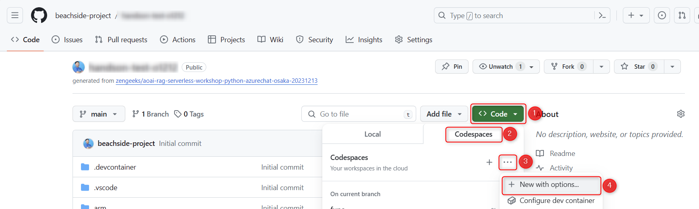
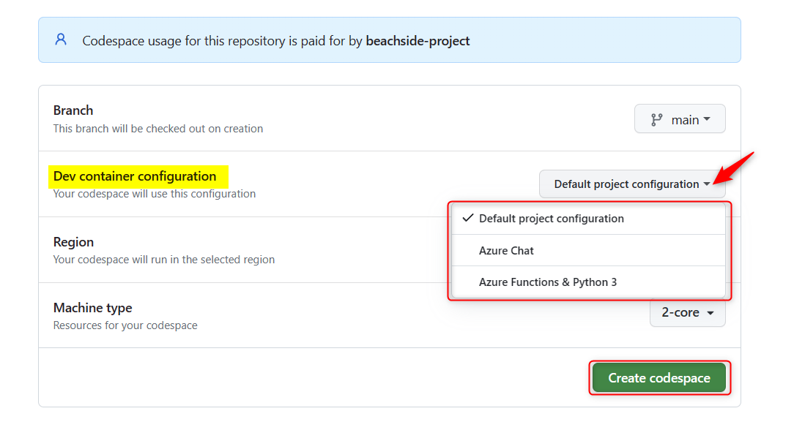
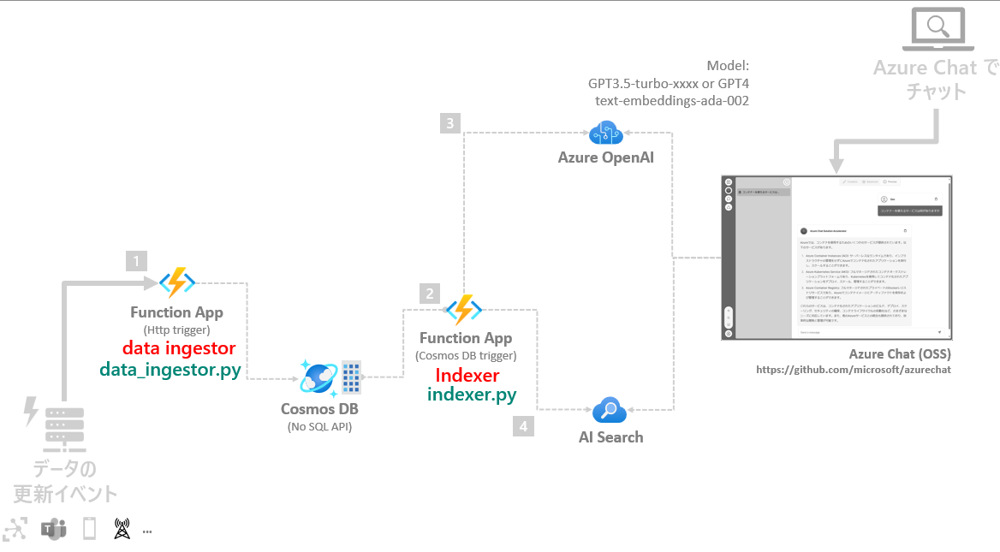

# 🧪 D1. テンプレートのコードをセットアップ

**GitHub Codespaces** は、Python などの言語を利用しているときに開発者個々の環境で相違が起きがちな開発環境を制御し、統一して開発を進めることができます。  
このハンズオンは、GitHub の Codespaces のメリットを活かし、全員が統一された開発環境でハンズオンを行ないます。

ここでは、以下のステップで Codespaces の起動確認と `handson-app` がデバッグ実行できるようにセットアップします。

- Codespaces の起動
- handson-app の構成
- デバッグ実行の準備
- デバッグ実行

 

## 🔖 Function App 専用 のCodespaces を起動

ここからは、Function App 専用の GitHub Codespaces を利用してハンズオンを進めます。  

今回ハンズオンを行う repo で、"Code" ボタンをクリック (①) → "Codespaces" をクリック (②) → "..." をクリック (③) → "New with options" をクリック (④) します。

Cteate for Codespace の画面が表示されます。"Dev container configuration" で **Azure Functions & Python 3** を選択し "Create codespace" をクリックすると、Codespaces が起動します。

起動まで数分かかります。起動すると、ブラウザ上で VS Code が起動します。

 

## 🔖 handson-app の構成

Codespaces を起動すると、この repo の `handson-app` フォルダーが VS Code ルートとして開かれるように設定しています。 この中には Function App のコードに2つのトリガーの関数が含まれています。3つの関数の実装を更新し、ワークショップのゴールを目指します。

> 📝 これらの詳細はトレーナーが解説します。

Function | トリガー | 概要
--- | --- | ---
data_ingestor.py | HTTP Trigger | AI Search のインデックスの元となるデータをインジェストするための API です。
indexer.py | Cosmos DB Trigger| イベントドリブンでリアルタイムに AI Search のインデックスを更新するための処理です。

> 📝 今回はハンズオンでは、操作性の観点から1つの Function App に複数の Function を実装して進めます。本来は、スケーラビリティの観点から Function をまとめるか分けるかを考慮するのがベストプラクティスです。

 

## 🔖 デバッグ実行の準備: 環境変数のセットアップ

ここでは、`handson-app` をデバッグ実行するために必要となる local.settings.json をセットアップします。  
local.settings.json は、local.settings.json.sample を元にセットアップします。

> 📝 具体的な操作はトレーナーが解説します。

 

## 🔖 デバッグ実行

デバッグ実行をします。デバッグ開始時に「タスク 'func: host start' を見つけられませんでした。」が表示された場合は、VS Code のコマンドパレットで "**開発者: ウィンドウの再読み込み" (Developer: Reload Window)** を行ないます。

以下のポイントを参考に `handson-app` が正常に動作することを確認します。

> 📝 具体的なデバッグ方法と確認方法は、トレーナーが解説します。

- ✅ デバッグの実行で起動時にエラーがでないことを確認
- ✅ REST.http の中にある REST API のリクエストを実行して、正常に動作することを確認

 

## 📚 参考情報

このワークショップでは Function App の詳細は時間の都合のため省略しています。参考情報としてドキュメントの一部を紹介します。

- [Azure Functions の概要 - Microsoft Learn](https://learn.microsoft.com/ja-jp/azure/azure-functions/functions-overview?pivots=programming-language-python)
- [Azure Functions でのトリガーとバインドの概念 | Microsoft Learn](https://learn.microsoft.com/ja-jp/azure/azure-functions/functions-triggers-bindings?tabs=isolated-process%2Cpython-v2&pivots=programming-language-python)
- [Azure Functions 開発者ガイド | Microsoft Learn](https://learn.microsoft.com/ja-jp/azure/azure-functions/functions-reference?tabs=blob&pivots=programming-language-python)
- [クイックスタート: Visual Studio Code と Python を使用して Azure に関数を作成する | Microsoft Learn](https://learn.microsoft.com/ja-jp/azure/azure-functions/create-first-function-vs-code-python?pivots=python-mode-decorators)
- [Azure Functions のベストプラクティス | Microsoft Learn](https://learn.microsoft.com/ja-jp/azure/azure-functions/functions-best-practices?tabs=csharp)

 

## ⏭️ NEXT STEP ✨

これでコードをセットアップできました。次は、3つの Function の中で Intexer.py から実装を進めます。

---

[⏮️ 前へ](./setup-azure-resources.md) | [📋 目次](../README.md) | [⏭️ 次へ](./implement-indexer.md)
